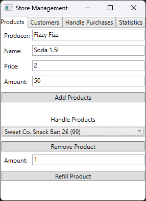
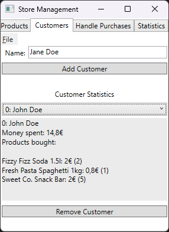
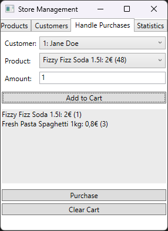

# Store Management

This is an example project. Store Management is a simple application for managing a store.

<table>
  <tr>
    <td align="center">
      
    </td>
    <td align="center">
      
    </td>
    <td align="center">
      
    </td>
   </tr>
</table>

## Installation

To install the application, download the latest [Release](https://github.com/jaketzu/StoreManagement/releases), and run it on a Windows PC.

You can clone the repository and run the app in Visual Studio. If you don't have Visual Studio with .NET set up on your device you can use [this guide](https://learn.microsoft.com/en-us/visualstudio/install/install-visual-studio?view=vs-2022).

### Usage

Handle products and customers with the 'Products' and 'Customers' tabs. Handle purchases for the customers with the 'Handle Purchases' tab.

## Made with

  

## Created by

**Jaakko Nevala**

